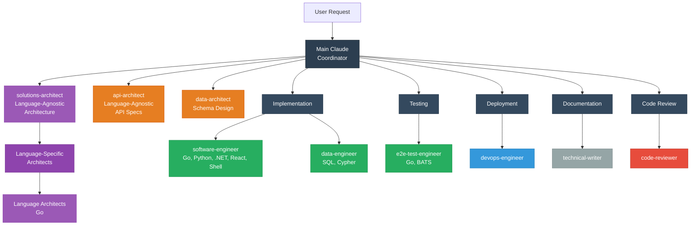
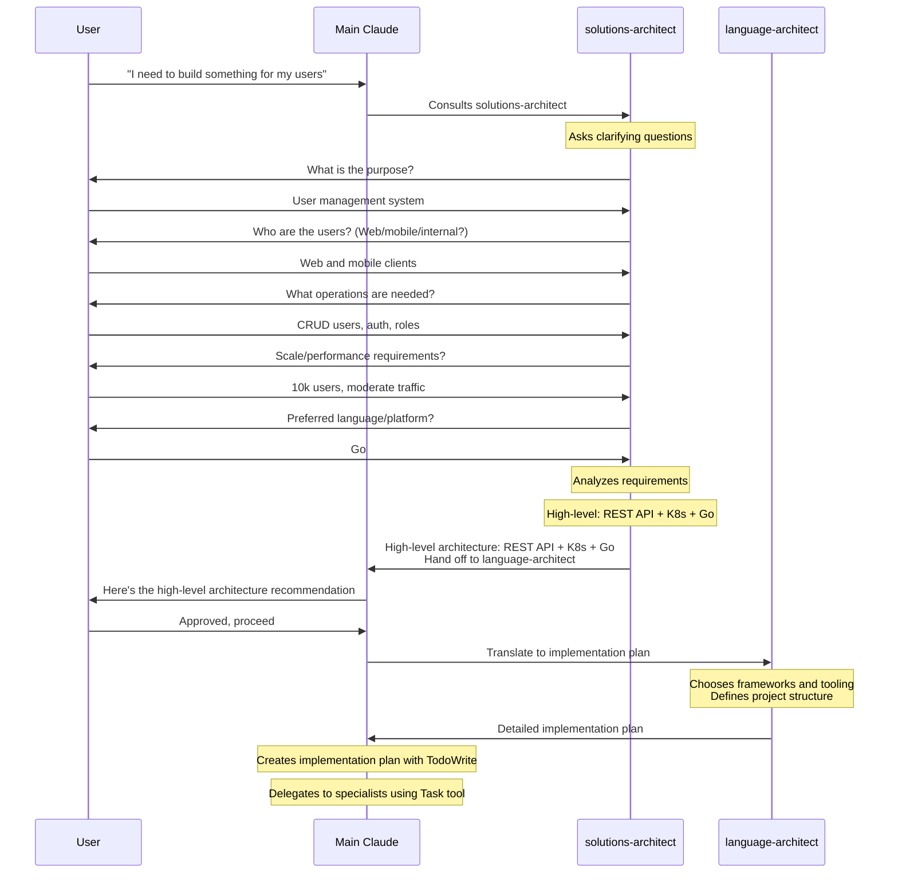
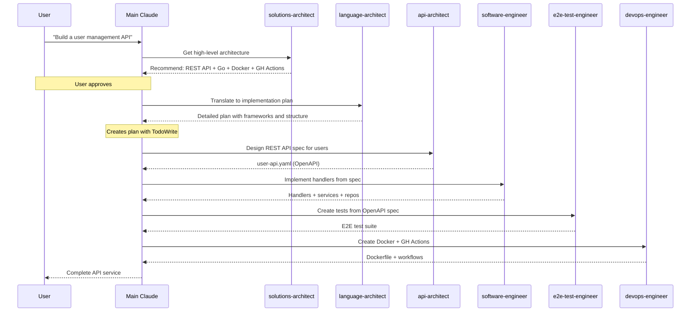
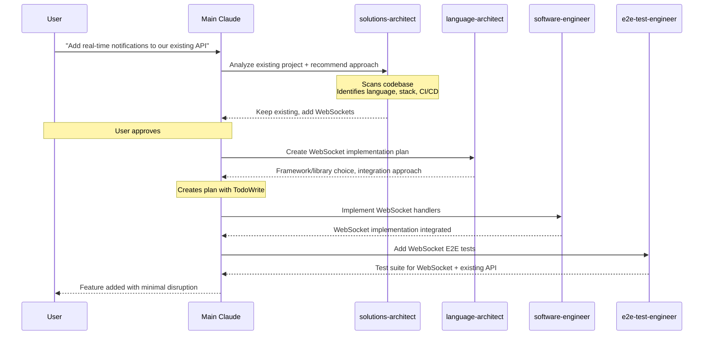
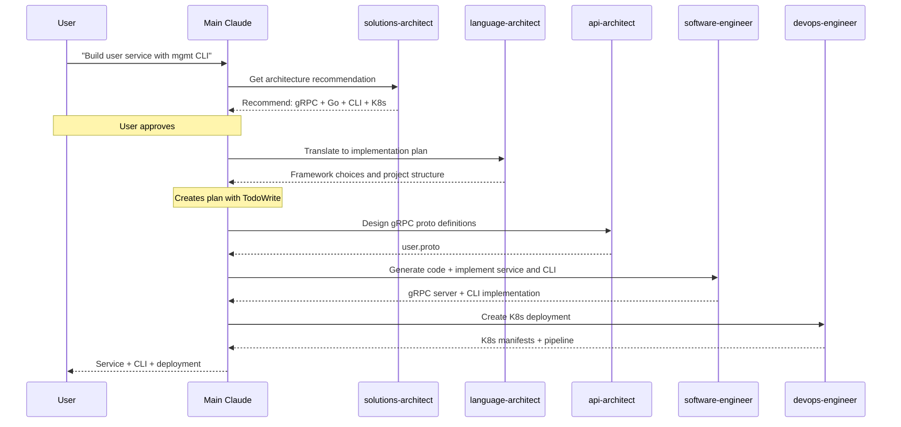
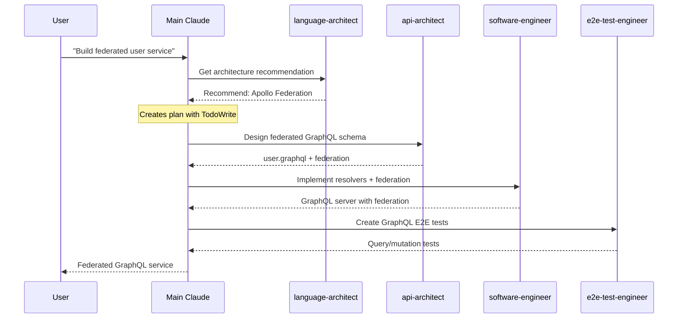
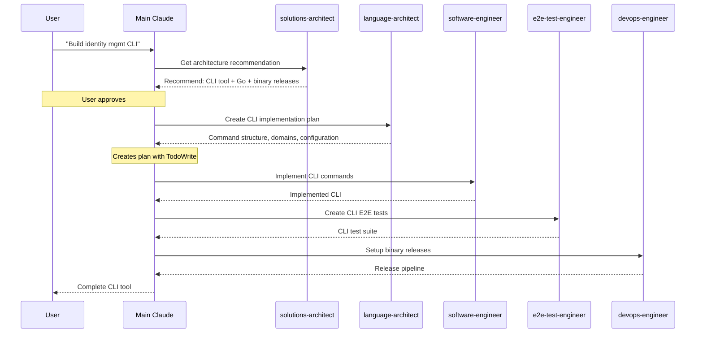
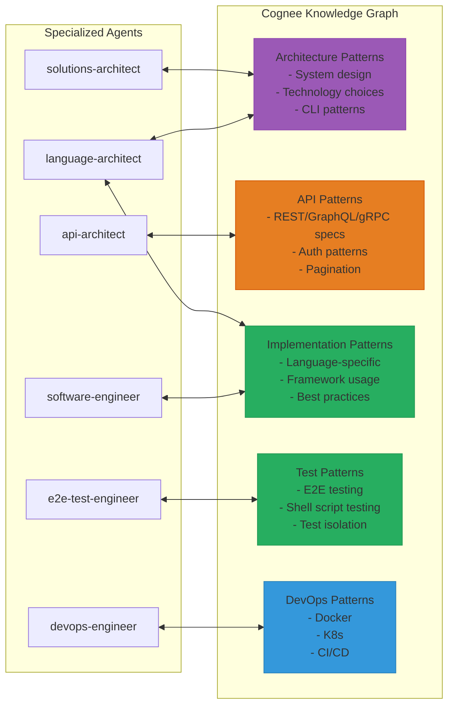
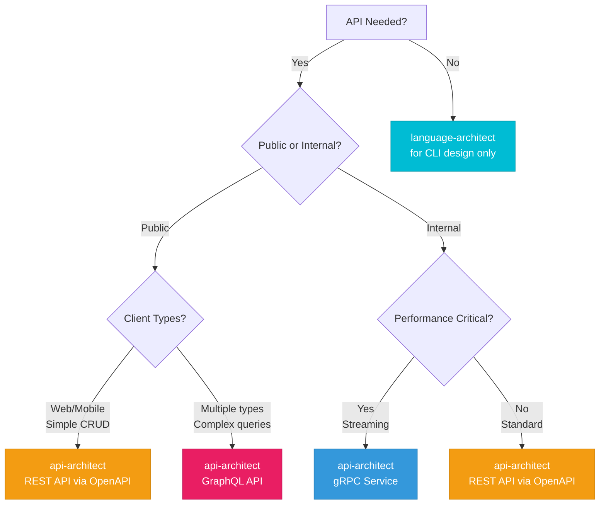
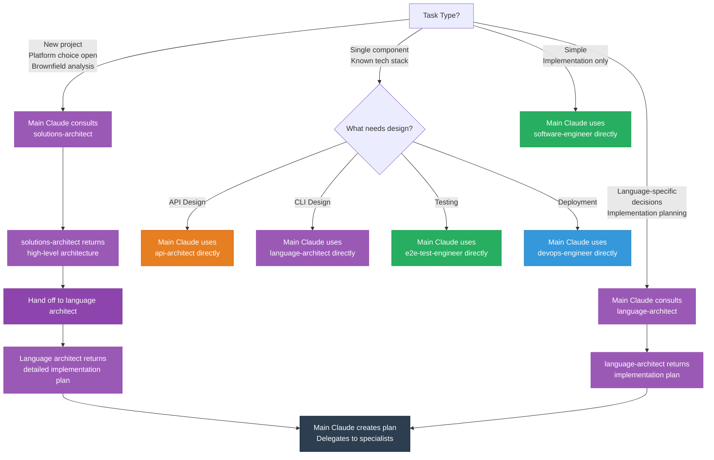

# Subagents for Claude Code

This document describes the specialized development agents and how they work together to deliver complete, production-ready projects across any language or platform.

## Overview

The agent ecosystem is organized with **Main Claude as the coordinator** that consults specialized agents. This architecture provides:

- **Main Claude coordinates**: Creates plans, delegates to specialists, tracks progress
- **Separation of concerns**: Each agent focuses on one specialized domain
- **Context efficiency**: Patterns stored in Cognee, not embedded in agents
- **Composability**: Agents can be used independently or orchestrated together
- **Maintainability**: Updates to one agent don't affect others

## Agent Hierarchy



## Requirements Gathering Phase

**When you have a business need**, Main Claude consults solutions-architect for architectural guidance:



**Key Point**: You don't need formal specs or technical documents upfront. Here's how it works:

1. **Main Claude consults solutions-architect** for high-level architecture recommendations
2. **solutions-architect asks questions** to understand business needs and constraints
3. **solutions-architect recommends high-level architecture** (API style, platform, deployment)
4. **User approves** the high-level architecture
5. **Main Claude delegates to language-specific architect** (go-software-architect, etc.)
6. **Language architect creates detailed implementation plan** (specific frameworks, structure, patterns)
7. **Main Claude creates plan** using TodoWrite
8. **Main Claude delegates** to specialists using Task tool

**Example Starting Points**:

- "I need an API for managing user accounts in my SaaS product"
- "Build a CLI tool for our ops team to manage cloud resources"
- "We need a real-time notification system for our mobile app"
- "Add real-time notifications to our existing Python API"
- NOT: "Implement the UserService as defined in spec-v2.3.pdf" (too specific, skip straight to language engineer)

## Common Workflows

### Workflow 1: New REST API Service (Greenfield)



### Workflow 2: Adding Feature to Existing Project (Brownfield)



### Workflow 3: New gRPC Microservice with CLI (Greenfield)



### Workflow 4: GraphQL API with Federation (Greenfield)



### Workflow 5: CLI Tool Only (Greenfield)



## Cognee Integration

Architecture and specialized agents query the Cognee knowledge graph for patterns before designing:



### Pattern Query Flow

1. **Agent receives task** from coordinator or user
2. **Agent searches Cognee** using `search()` with appropriate search_type
3. **Agent adapts patterns** to specific requirements
4. **Agent delivers artifacts** (specs, code, tests, configs)

### Why Cognee?

- **Context efficiency**: ~80% reduction in agent size
- **Pattern reuse**: Same patterns across multiple agents
- **Maintainability**: Update patterns once, all agents benefit
- **Separation of concerns**: Agents contain logic, not data

## Decision Trees

### Choosing the Right API Style



### Choosing Which Architect to Consult



### Utility Agents

#### rlm-subcall

**Role**: Recursive Language Model subagent for large-context processing
**Responsibilities**:

- Process chunks of large documents that exceed context limits
- Support the RLM skill workflow for long-context tasks

**When to use**: Invoked automatically by the `/rlm` skill; not typically used directly.

## Best Practices

### 1. Choose the Right Architect

**For new projects or platform decisions**:

- Consult solutions-architect for high-level architecture
- solutions-architect analyzes existing projects (brownfield)
- solutions-architect hands off to language-specific architect

**For existing language-specific projects**:

- Consult language-architect directly for language-specific decisions
- language-architect translates high-level architecture to implementation plans
- language-architect recommends frameworks and patterns

### 2. Respect Existing Projects

When working with brownfield projects:

- solutions-architect scans codebase to understand what exists
- Preserve working CI/CD, infrastructure, and patterns
- Incremental improvements over rewrites
- Migration paths for necessary changes

### 3. Main Claude Coordinates Implementation

After architecture recommendations:

- Create implementation plan with TodoWrite
- Delegate to specialists using Task tool
- Track progress through each phase
- Ensure consistency across components

### 4. Use Specialized Agents for Design

Let each specialist design their domain:

- api-architect for all API specifications (OpenAPI/GraphQL/gRPC)
- Language architects for CLI command structures and patterns
- DevOps engineers for deployment

### 5. Generate Code from Specs

Never hand-write API types:

- OpenAPI → `oapi-codegen` (Go), or language-specific generators
- GraphQL → `gqlgen` (Go), or language-specific generators
- gRPC → `buf generate` (multi-language)

### 6. Test Against Specs

Use E2E tests to validate implementation:

- Tests should match API specifications exactly
- Black-box testing from user perspective
- Validate both success and error scenarios

### 7. Sequence Work Properly

Main Claude follows this order:

1. Consult solutions-architect (new projects/platform decisions) OR language-architect (language-specific)
2. Language-architect creates detailed implementation plan including CLI design if applicable
3. Design API specs (delegate to api-architect if API project)
4. Generate code from specs (language-architect chooses generators)
5. Implement business logic and CLI commands (delegate to software-engineer)
6. Wire handlers/resolvers/commands
7. Write E2E tests (delegate to e2e-test-engineer)
8. Create deployment artifacts (delegate to devops-engineer)

## Example: Complete Project Flow

Here's how to build a complete SaaS API project using the agent ecosystem:

```bash
# 1. User starts with a business need (no technical spec required)
User: "I need to build a SaaS application for managing teams and projects."

# 2. Main Claude consults solutions-architect
Main Claude: [Uses Task tool with solutions-architect]

# 3. solutions-architect asks clarifying questions
solutions-architect: "Let me understand your requirements:
  - Who are the users? (web, mobile, internal systems?)
  - What operations do you need? (CRUD, real-time updates?)
  - How many users/what scale?
  - Deployment preferences?"

User: "Web and mobile clients. Users and organizations with role-based access.
       Real-time notifications when projects update. Start with 1000 orgs,
       plan to scale. Deploy to Kubernetes on AWS."

# 4. solutions-architect returns recommendations and hands off
solutions-architect: "Architecture Recommendation:
  - GraphQL API (multiple clients, real-time subscriptions)
  - gRPC for internal microservices (high performance)
  - Ops CLI for management
  - Kubernetes deployment (K8s + Helm)
  - GitHub Actions CI/CD
  - Go as implementation language

  Next: Hand off to language-architect (go-software-architect) for detailed implementation plan"

# 5. Main Claude delegates to language-architect
Main Claude: [Uses Task tool with go-software-architect]

# 6. language-architect returns detailed plan
language-architect: "Implementation Plan:
  - gqlgen for GraphQL, buf for gRPC, Cobra for CLI
  - Project structure: cmd/, internal/, api/
  - Domain-based organization

  Next Steps for Main Claude:
  1. Delegate to api-architect for GraphQL schema and gRPC proto definitions
  2. Delegate to software-engineer for implementation (GraphQL, gRPC, CLI)
  3. Delegate to e2e-test-engineer for testing
  4. Delegate to devops-engineer for deployment"

# 7. Main Claude presents plan to user
User: "Looks good, proceed."

# 8. Main Claude creates implementation plan
Main Claude: [Uses TodoWrite to create phased plan]

# 9. Main Claude delegates to specialists (using Task tool)
# Phase 1: API Design
# → api-architect designs GraphQL schema and gRPC definitions
# Phase 2: Implementation
# → software-engineer implements GraphQL, gRPC, and CLI
# Phase 3: Testing
# → e2e-test-engineer creates test suite
# Phase 4: Deployment
# → devops-engineer creates K8s + CI/CD

# Result: Complete production-ready SaaS API
#   - User provided business needs in natural language
#   - solutions-architect created high-level architecture
#   - language-architect translated to detailed implementation plan
#   - Main Claude coordinated implementation
#   - Specialists designed and implemented each piece
#   - All components work together as a cohesive system
```

## Agent Color Coding

For quick visual identification in Claude Code:

- **Purple** - solutions-architect (language-agnostic), language-architect (language-specific implementation)
- **Orange** - api-architect (REST/GraphQL/gRPC specifications), data-architect (schema design)
- **Green** - software-engineer (implementation for all languages), e2e-test-engineer (testing), data-engineer (SQL/Cypher)
- **Red** - code-reviewer (pattern compliance and code review)
- **Blue** - devops-engineer (deployment and CI/CD)
- **Gray** - technical-writer (documentation)

## Summary

The agent ecosystem provides:

- **Main Claude coordinates** - Creates plans with TodoWrite, delegates with Task tool, tracks progress
- **solutions-architect consults** - Translates business needs to high-level architecture recommendations
- **language-architect plans** - Translates high-level architecture to detailed implementation plans
- **No formal specs required** - Start with natural language, architects ask clarifying questions
- **Multi-language support** - Same workflow for Go, Python, .NET, and shell scripts
- **Separation of concerns** - Each agent has one focused responsibility
- **Context efficiency** - Patterns in Cognee, not embedded in agents
- **Composability** - Use agents independently or orchestrated together
- **Maintainability** - Update one agent without affecting others
- **Scalability** - Add new languages without redesigning

**Getting Started**:

- **Complex projects**: Main Claude consults solutions-architect for high-level architecture, then language-architect for implementation plan, then coordinates specialists
- **Language-specific projects**: Main Claude consults language-architect directly, then coordinates specialists
- **Single component**: Main Claude delegates directly to specialist (api-architect, software-engineer, etc.)
- **Simple tasks**: Main Claude uses software-engineer directly for implementation
- **Don't have architecture?** Main Claude consults solutions-architect (language-agnostic) or language-architect (language-specific) to create it through conversation
