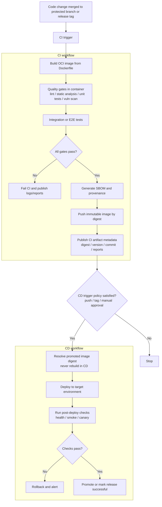

# Docker-First CI/CD Reference Example

This is an organization-level reference example for Docker-first delivery pipelines.
It is intentionally generic and not tied to one language, runtime, or registry.

