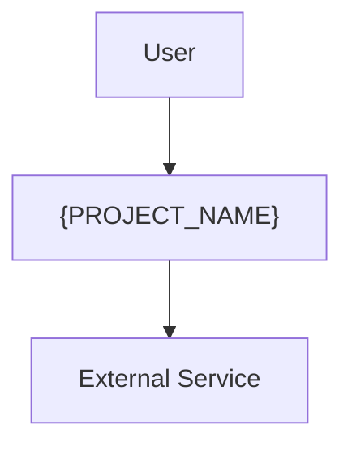

<!-- Template: 00-overview.md
     Purpose: High-level system overview and navigation hub for all architecture docs.
     This is the entry point — keep it concise and ensure the navigation table stays current. -->

# {PROJECT_NAME} — Architecture Overview

[Back to Project README](../../README.md)

## Table of Contents

- [Introduction](#introduction)
- [Core Concept](#core-concept)
- [System Model](#system-model)
- [Key Principles](#key-principles)
- [Document Navigation](#document-navigation)

## Introduction

<!-- Describe what the system does, who uses it, and why it exists.
     Keep this to 2-3 paragraphs. Answer: What problem does it solve? Who are the users? -->

## Core Concept

<!-- Provide a high-level conceptual view of the system and its environment.
     Include a C4 Context diagram or simple block diagram showing the system
     and its key external actors/systems. -->

## System Model

<!-- List the major building blocks of the system. For each, provide a one-line
     description of its role. This is an overview — details belong in
     03-system-architecture.md. -->

| Component               | Description                        |
| ----------------------- | ---------------------------------- |
| <!-- component name --> | <!-- one-line role description --> |

## Key Principles

<!-- List 3-5 architectural principles guiding the design. For each, provide
     the principle name and a brief rationale for why it was chosen. -->

1. **{Principle}** — {Rationale}

## Document Navigation

<!-- Only list documents that actually exist. Update this table when adding
     or removing docs. Check docs/architecture/ with Glob before updating. -->

| #   | Document                                                       | Description                           | Status          |
| --- | -------------------------------------------------------------- | ------------------------------------- | --------------- |
| 00  | [Overview](00-overview.md)                                     | This document                         | Current         |
| 01  | [Requirements](01-requirements.md)                             | Problem statement, goals, constraints | <!-- status --> |
| 02  | [Architectural Decisions](02-architectural-decisions.md)       | ADR log                               | <!-- status --> |
| 03  | [System Architecture](03-system-architecture.md)               | Components, data flow, boundaries     | <!-- status --> |
| 04  | [Communication Patterns](04-communication-patterns.md)         | API protocols, integrations           | <!-- status --> |
| 05  | [Deployment Architecture](05-deployment-architecture.md)       | Deployment, infrastructure, scaling   | <!-- status --> |
| 06  | [Security Architecture](06-security-architecture.md)           | Auth, encryption, audit               | <!-- status --> |
| 07  | [Observability Architecture](07-observability-architecture.md) | Monitoring, logging, tracing          | <!-- status --> |
| 08  | [Data Architecture](08-data-architecture.md)                   | Databases, data models, migrations    | <!-- status --> |

**Next:** [Requirements](01-requirements.md)
