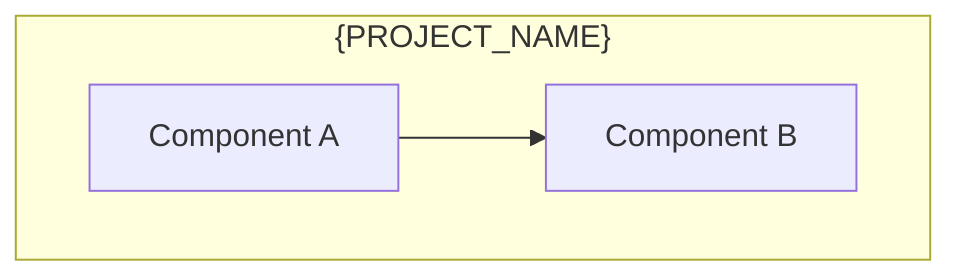
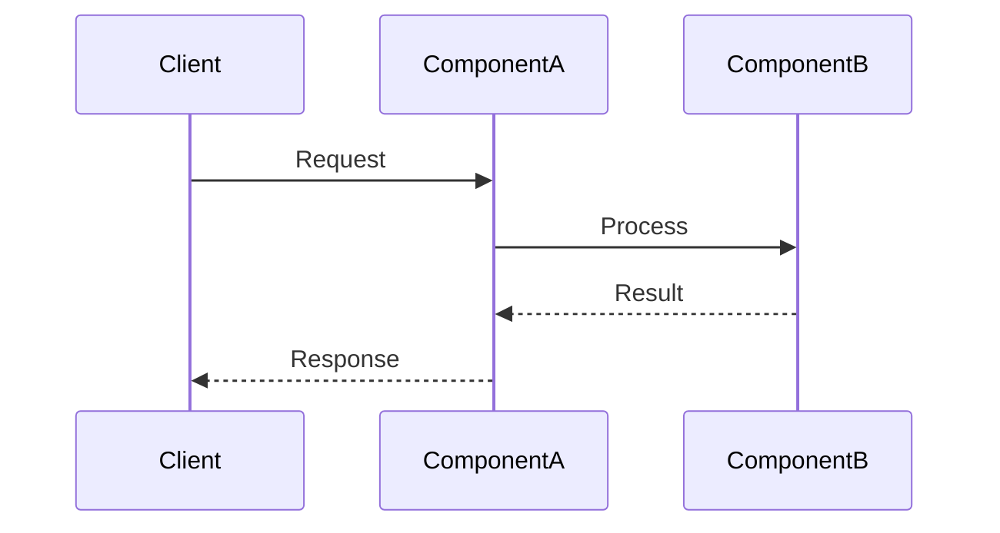
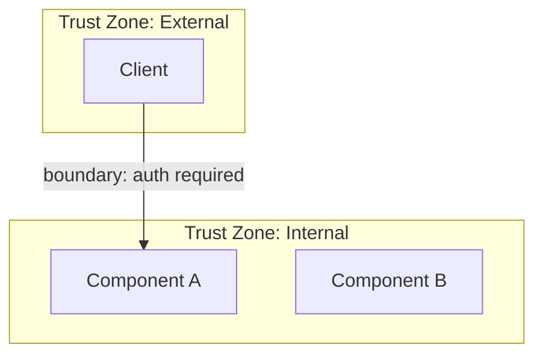

<!-- Template: 03-system-architecture.md
     Purpose: Detail the system's component architecture, data flow, interactions,
     and boundary definitions. This is the technical heart of the architecture docs. -->

# {PROJECT_NAME} — System Architecture

[Back to Overview](00-overview.md) | [Back to Project README](../../README.md)

## Table of Contents

- [Architecture Overview](#architecture-overview)
- [Component Breakdown](#component-breakdown)
- [Data Flow](#data-flow)
- [Component Interactions](#component-interactions)
- [Boundary Definitions](#boundary-definitions)

## Architecture Overview

<!-- High-level description of the architecture. Include a C4 Container diagram
     showing all major components, their technologies, and relationships. -->

## Component Breakdown

<!-- For each major component, create a subsection. Describe what each component
     does, not how it does it — implementation detail belongs in code, not architecture docs. -->

### {Component Name}

**Responsibilities:**

- <!-- responsibility -->

**Key Characteristics:**

| Characteristic   | Value                                   |
| ---------------- | --------------------------------------- |
| Language/Runtime | <!-- e.g., Go 1.22 -->                  |
| Persistence      | <!-- e.g., PostgreSQL, none -->         |
| Scaling Model    | <!-- e.g., horizontal, stateless -->    |
| Communication    | <!-- e.g., gRPC server, REST client --> |

<!-- Optional: include an internal structure diagram for complex components -->

## Data Flow

<!-- Show the primary data flow through the system using a sequence diagram.
     Document the happy path first. Add error paths as separate diagrams if needed. -->

## Component Interactions

<!-- Document every inter-component communication. This table is the definitive
     reference for how components talk to each other. -->

| From            | To              | Protocol                                 | Purpose      | Data Format                   |
| --------------- | --------------- | ---------------------------------------- | ------------ | ----------------------------- |
| <!-- source --> | <!-- target --> | <!-- e.g., gRPC, REST, message queue --> | <!-- why --> | <!-- e.g., Protobuf, JSON --> |

## Boundary Definitions

<!-- Show trust boundaries, network boundaries, and deployment boundaries.
     Document what crosses each boundary and what rules govern that crossing. -->

**Boundary Rules:**

| Boundary               | What Crosses           | Rules                                       |
| ---------------------- | ---------------------- | ------------------------------------------- |
| <!-- boundary name --> | <!-- data/requests --> | <!-- auth, encryption, validation rules --> |

**Next:** [Communication Patterns](04-communication-patterns.md)
