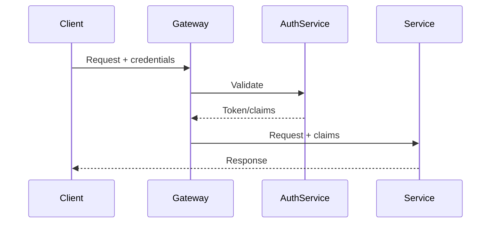

<!-- Template: 04-communication-patterns.md
     Purpose: Document API protocol choices, design patterns, integration patterns,
     and error handling strategies across the system. -->

# {PROJECT_NAME} — Communication Patterns

[Back to Overview](00-overview.md) | [Back to Project README](../../README.md)

## Table of Contents

- [Protocol Choices](#protocol-choices)
- [API Design Patterns](#api-design-patterns)
- [Endpoint Reference](#endpoint-reference)
- [Integration Patterns](#integration-patterns)
- [Error Handling](#error-handling)
- [Authentication and Authorization Flow](#authentication-and-authorization-flow)

## Protocol Choices

<!-- Justify why each protocol was chosen. Reference ADRs from
     02-architectural-decisions.md where applicable. -->

| Protocol                 | Use Case            | Rationale                  |
| ------------------------ | ------------------- | -------------------------- |
| <!-- e.g., REST/HTTP --> | <!-- where used --> | <!-- why this protocol --> |

## API Design Patterns

<!-- Document the conventions all APIs in this system should follow.
     Include naming patterns, versioning strategy, and pagination approach. -->

### Naming Conventions

- <!-- e.g., REST: plural nouns for collections, kebab-case paths -->

### Versioning Strategy

- <!-- e.g., URL path versioning /v1/, header versioning, etc. -->

### Pagination

- <!-- e.g., cursor-based, offset-based, page tokens -->

## Endpoint Reference

<!-- High-level reference grouped by domain. This is NOT a full API spec —
     detailed specs belong in OpenAPI/proto files. Link to those specs if they exist. -->

### {Domain}

| Method             | Path                     | Purpose                    |
| ------------------ | ------------------------ | -------------------------- |
| <!-- e.g., GET --> | <!-- e.g., /v1/users --> | <!-- brief description --> |

## Integration Patterns

<!-- How the system integrates with external services. Document resilience
     patterns: retry policies, circuit breakers, timeout strategies, fallbacks. -->

| External Service | Integration Method              | Retry Policy                                  | Circuit Breaker    | Timeout           |
| ---------------- | ------------------------------- | --------------------------------------------- | ------------------ | ----------------- |
| <!-- service --> | <!-- e.g., REST client, SDK --> | <!-- e.g., 3 retries, exponential backoff --> | <!-- threshold --> | <!-- duration --> |

## Error Handling

<!-- Document the standard error response format, error codes, and how errors
     propagate through the system. -->

### Standard Error Response Format

<!-- Define the JSON error response structure used across all APIs -->

### Error Codes

| Code Range         | Category                    | Description            |
| ------------------ | --------------------------- | ---------------------- |
| <!-- e.g., 4xx --> | <!-- e.g., Client Error --> | <!-- when returned --> |

### Error Propagation

<!-- How errors flow through the system. Do internal errors leak to clients?
     How are upstream failures handled? -->

## Authentication and Authorization Flow

<!-- Document how requests are authenticated and authorized across service
     boundaries. Reference 06-security-architecture.md for detailed security model. -->

**Next:** [Deployment Architecture](05-deployment-architecture.md)
