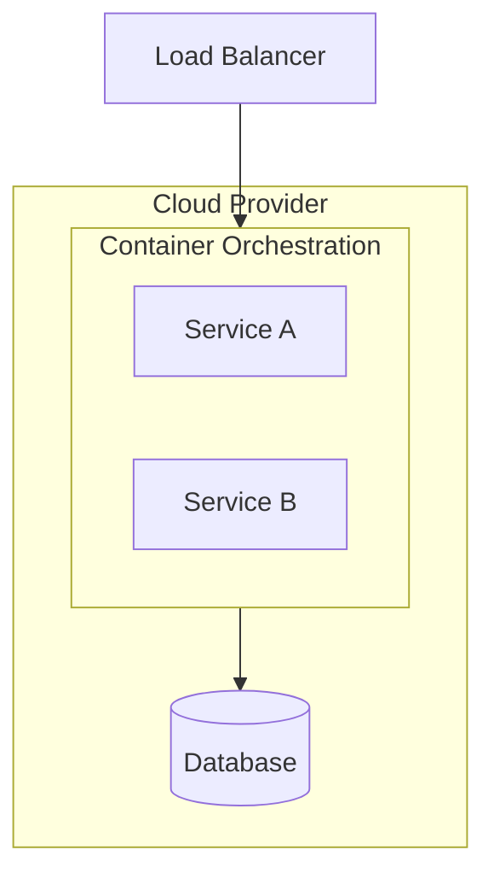
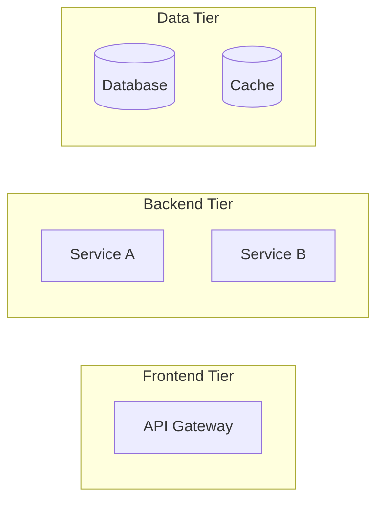

<!-- Template: 05-deployment-architecture.md
     Purpose: Document deployment topology, infrastructure requirements,
     operational considerations, and scaling strategy. -->

# {PROJECT_NAME} — Deployment Architecture

[Back to Overview](00-overview.md) | [Back to Project README](../../README.md)

## Table of Contents

- [Deployment Overview](#deployment-overview)
- [Deployment Topology](#deployment-topology)
- [Component Deployment](#component-deployment)
- [Infrastructure Requirements](#infrastructure-requirements)
- [Operational Considerations](#operational-considerations)
- [Scaling Considerations](#scaling-considerations)

## Deployment Overview

<!-- High-level deployment description. Include a deployment diagram showing
     infrastructure, containers/services, and their relationships. -->

## Deployment Topology

### Logical Topology

<!-- How components are grouped logically. Show service groupings,
     namespaces, and logical boundaries. -->

### Physical Topology

<!-- Where components run. Show regions, availability zones, nodes,
     and network configuration. -->

## Component Deployment

<!-- Per-component deployment details. Specify how each component is deployed,
     its resource requirements, and health check configuration. -->

| Component          | Runtime                        | Replicas           | Resources (CPU/Mem)            | Health Check                     |
| ------------------ | ------------------------------ | ------------------ | ------------------------------ | -------------------------------- |
| <!-- component --> | <!-- e.g., Docker, K8s Pod --> | <!-- e.g., 2-4 --> | <!-- e.g., 0.5 CPU / 512Mi --> | <!-- e.g., /health, TCP 8080 --> |

## Infrastructure Requirements

<!-- Hardware/cloud resource requirements. Cover compute, storage, and networking. -->

| Resource               | Specification               | Purpose           |
| ---------------------- | --------------------------- | ----------------- |
| <!-- e.g., Compute --> | <!-- e.g., 4x t3.medium --> | <!-- why -->      |
| <!-- e.g., Storage --> | <!-- e.g., 100GB gp3 -->    | <!-- for what --> |
| <!-- e.g., Network --> | <!-- e.g., VPC, subnets --> | <!-- purpose -->  |

## Operational Considerations

<!-- Focus on day-2 operations — how the system is run and maintained. -->

### Monitoring

<!-- What to monitor and alerting thresholds. Reference 07-observability-architecture.md
     for detailed observability strategy. -->

- <!-- key metric and threshold -->

### Logging

<!-- Log aggregation approach and retention policy. -->

- <!-- logging approach -->

### Backup and Recovery

<!-- Backup strategy, Recovery Point Objective (RPO), and Recovery Time Objective (RTO). -->

| Data Store     | Backup Method   | Frequency          | RPO          | RTO          |
| -------------- | --------------- | ------------------ | ------------ | ------------ |
| <!-- store --> | <!-- method --> | <!-- frequency --> | <!-- RPO --> | <!-- RTO --> |

### Updates and Rollbacks

<!-- Deployment strategy for updates. Document rollback procedures. -->

- **Deployment Strategy:** <!-- e.g., rolling update, blue-green, canary -->
- **Rollback Procedure:** <!-- how to roll back a bad deployment -->
- **Zero-Downtime:** <!-- yes/no, how achieved -->

## Scaling Considerations

<!-- Horizontal vs. vertical scaling strategy per component. Document scaling
     boundaries and known bottlenecks. -->

| Component          | Scaling Type                 | Trigger                  | Min                    | Max                    |
| ------------------ | ---------------------------- | ------------------------ | ---------------------- | ---------------------- |
| <!-- component --> | <!-- horizontal/vertical --> | <!-- e.g., CPU > 70% --> | <!-- min instances --> | <!-- max instances --> |

### Known Bottlenecks

<!-- Document components that limit overall throughput and mitigation strategies. -->

- <!-- bottleneck and mitigation -->

**Next:** [Security Architecture](06-security-architecture.md)
