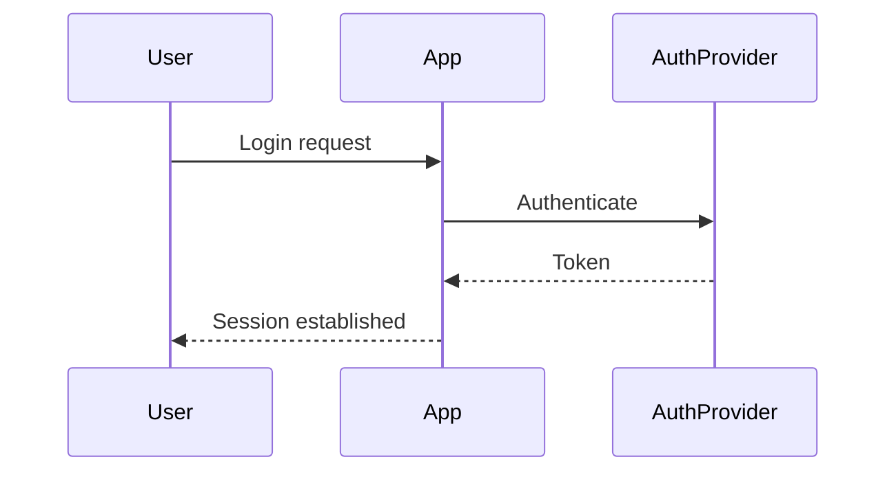
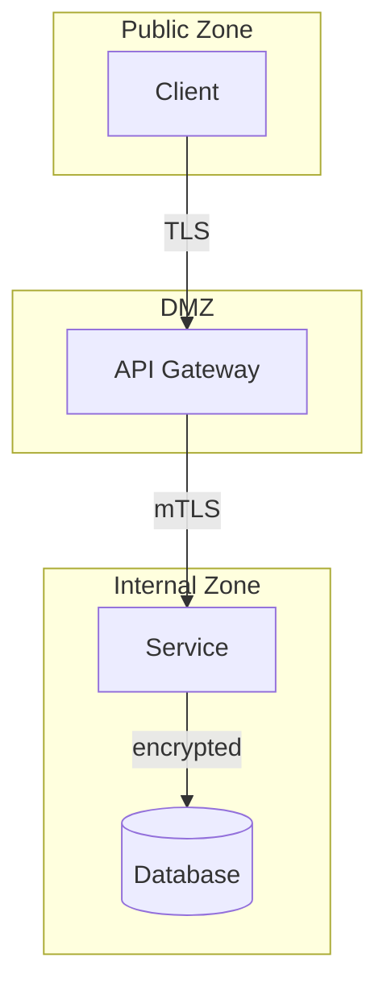

<!-- Template: 06-security-architecture.md
     Purpose: Document the security model including authentication, authorization,
     encryption, audit logging, and vulnerability management. -->

# {PROJECT_NAME} — Security Architecture

[Back to Overview](00-overview.md) | [Back to Project README](../../README.md)

## Table of Contents

- [Security Overview](#security-overview)
- [Authentication Model](#authentication-model)
- [Authorization and Access Control](#authorization-and-access-control)
- [Encryption](#encryption)
- [Audit Logging](#audit-logging)
- [Security Boundaries](#security-boundaries)
- [Vulnerability Management](#vulnerability-management)

## Security Overview

<!-- Describe the overall security approach and key assets to protect.
     Summarize the threat model: who are the threat actors, what are the
     attack surfaces, and what is the security posture. -->

## Authentication Model

<!-- How users and services authenticate. Cover both user-facing auth
     and service-to-service auth. -->

### User Authentication

<!-- Auth flow for end users. Include the sequence diagram below. -->

### Service-to-Service Authentication

<!-- How services authenticate with each other. mTLS, JWT, API keys, etc. -->

## Authorization and Access Control

<!-- Document the access control model (RBAC, ABAC, etc.) and the permission matrix. -->

### Access Control Model

<!-- e.g., RBAC with role hierarchy, ABAC with attribute policies -->

### Permission Matrix

| Role          | Resource          | Permissions                        |
| ------------- | ----------------- | ---------------------------------- |
| <!-- role --> | <!-- resource --> | <!-- e.g., read, write, delete --> |

## Encryption

<!-- Data encryption at rest and in transit. Cover all sensitive data paths. -->

| Data Type                       | At Rest                | In Transit             | Key Management         |
| ------------------------------- | ---------------------- | ---------------------- | ---------------------- |
| <!-- e.g., user credentials --> | <!-- e.g., AES-256 --> | <!-- e.g., TLS 1.3 --> | <!-- e.g., AWS KMS --> |

## Audit Logging

<!-- What security-relevant events are logged, in what format, and for how long.
     These logs support compliance and incident investigation. -->

| Event Category                | Events Logged                                       | Retention Period       |
| ----------------------------- | --------------------------------------------------- | ---------------------- |
| <!-- e.g., Authentication --> | <!-- e.g., login success/failure, token refresh --> | <!-- e.g., 90 days --> |

## Security Boundaries

<!-- Diagram showing trust zones and security boundaries. Reference the boundary
     definitions from 03-system-architecture.md. -->

## Vulnerability Management

<!-- How security vulnerabilities are detected and handled. -->

- **Dependency Scanning:** <!-- tool and frequency -->
- **Container Scanning:** <!-- tool and frequency -->
- **Update Policy:** <!-- how quickly patches are applied -->
- **Incident Response:** <!-- reference to incident response plan or summary -->

**Next:** [Observability Architecture](07-observability-architecture.md)
