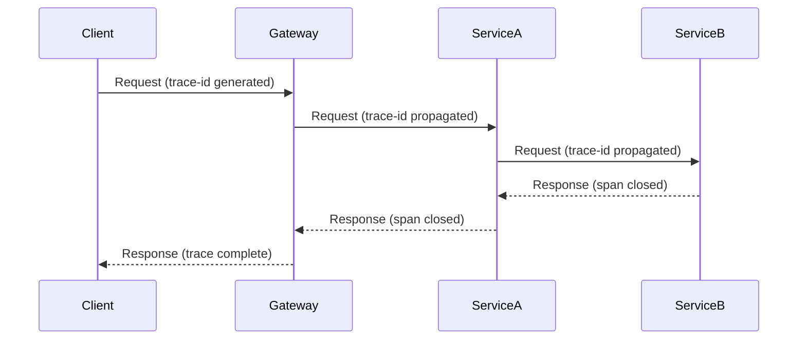

<!-- Template: 07-observability-architecture.md
     Purpose: Document the observability strategy covering the three pillars:
     metrics, logs, and traces, plus alerting and SLO definitions. -->

# {PROJECT_NAME} — Observability Architecture

[Back to Overview](00-overview.md) | [Back to Project README](../../README.md)

## Table of Contents

- [Observability Overview](#observability-overview)
- [Monitoring Strategy](#monitoring-strategy)
- [Logging Architecture](#logging-architecture)
- [Distributed Tracing](#distributed-tracing)
- [Alerting](#alerting)
- [SLOs and Error Budgets](#slos-and-error-budgets)

## Observability Overview

<!-- Describe the observability strategy and its goals. Cover the three pillars
     (metrics, logs, traces) and how they work together to provide system insight. -->

## Monitoring Strategy

<!-- What metrics are collected, how, and where they're visualized.
     Cover infrastructure, application, and business metrics. -->

| Metric Category | Key Metrics                                      | Collection Method                     | Dashboard               |
| --------------- | ------------------------------------------------ | ------------------------------------- | ----------------------- |
| Infrastructure  | <!-- e.g., CPU, memory, disk -->                 | <!-- e.g., node_exporter -->          | <!-- dashboard name --> |
| Application     | <!-- e.g., request rate, error rate, latency --> | <!-- e.g., Prometheus client -->      | <!-- dashboard name --> |
| Business        | <!-- e.g., signups, transactions -->             | <!-- e.g., custom instrumentation --> | <!-- dashboard name --> |

## Logging Architecture

<!-- Log levels, structured logging format, and the aggregation pipeline.
     Standardize the log format across all services. -->

### Log Format

<!-- Define the structured log format. Example fields: timestamp, level,
     service, trace_id, message, error. -->

### Log Pipeline

### Log Levels

| Level | Usage                | Example                  |
| ----- | -------------------- | ------------------------ |
| ERROR | <!-- when to use --> | <!-- example message --> |
| WARN  | <!-- when to use --> | <!-- example message --> |
| INFO  | <!-- when to use --> | <!-- example message --> |
| DEBUG | <!-- when to use --> | <!-- example message --> |

### Log Retention

<!-- How long logs are kept and any tiering strategy (hot/warm/cold). -->

## Distributed Tracing

<!-- Tracing implementation, span naming conventions, and sampling strategy.
     Document how traces propagate across service boundaries. -->

### Trace Propagation

### Span Naming Conventions

<!-- e.g., HTTP: "HTTP GET /v1/users", gRPC: "grpc.users.GetUser" -->

### Sampling Strategy

<!-- e.g., 100% for errors, 10% for successful requests, always for specific paths -->

## Alerting

<!-- Alert rules, escalation paths, and runbook references.
     Focus on actionable alerts — avoid alert fatigue. -->

| Alert Name     | Condition                             | Severity                       | Response                        |
| -------------- | ------------------------------------- | ------------------------------ | ------------------------------- |
| <!-- alert --> | <!-- e.g., error rate > 5% for 5m --> | <!-- critical/warning/info --> | <!-- runbook link or action --> |

### Escalation Paths

<!-- Who gets notified and when. Define escalation tiers. -->

## SLOs and Error Budgets

<!-- Service Level Objectives tied to reliability targets.
     SLIs (indicators) measure behavior, SLOs set targets, error budgets define tolerance. -->

| Service          | SLI                                      | SLO Target           | Error Budget (30d)          |
| ---------------- | ---------------------------------------- | -------------------- | --------------------------- |
| <!-- service --> | <!-- e.g., availability, latency p99 --> | <!-- e.g., 99.9% --> | <!-- e.g., 43.2 minutes --> |

### Error Budget Policy

<!-- What happens when the error budget is exhausted? e.g., freeze feature releases,
     focus on reliability work. -->

**Next:** [Data Architecture](08-data-architecture.md)
