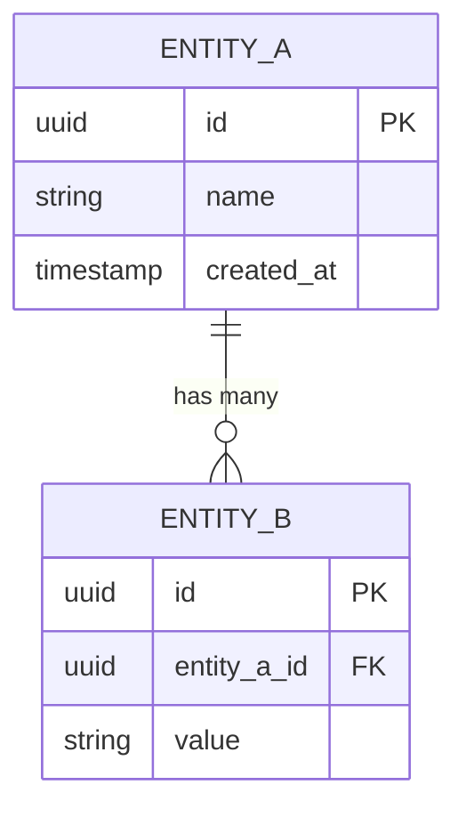
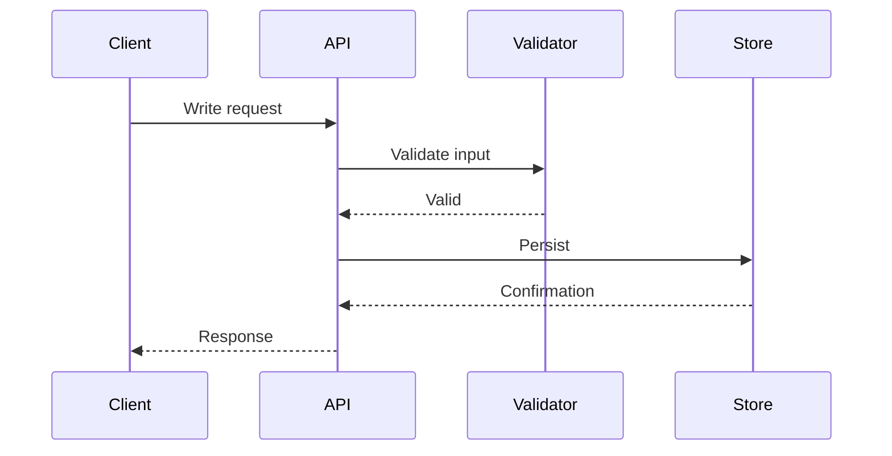
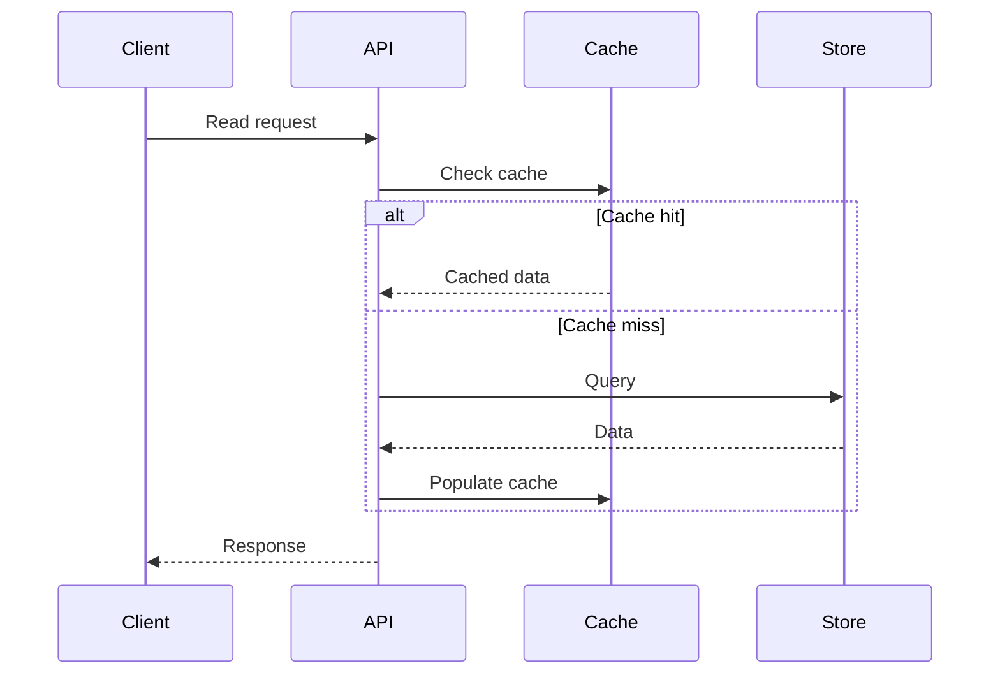

<!-- Template: 08-data-architecture.md
     Purpose: Document database technology choices, data models, storage architecture,
     data flow patterns, consistency model, and migration strategy. -->

# {PROJECT_NAME} — Data Architecture

[Back to Overview](00-overview.md) | [Back to Project README](../../README.md)

## Table of Contents

- [Database Technology Stack](#database-technology-stack)
- [Data Model Design](#data-model-design)
- [Storage Architecture](#storage-architecture)
- [Data Flow Patterns](#data-flow-patterns)
- [Consistency and Integrity](#consistency-and-integrity)
- [Migration Strategy](#migration-strategy)

## Database Technology Stack

<!-- For each database or data store used, document its purpose and justify the choice.
     Reference ADRs from 02-architectural-decisions.md for the technology selection rationale. -->

### {Database Name}

**Purpose:** <!-- What data it stores and why this store was chosen for this data -->

| Criterion                     | Requirement                                        | How This DB Meets It                             |
| ----------------------------- | -------------------------------------------------- | ------------------------------------------------ |
| <!-- e.g., Query patterns --> | <!-- e.g., complex joins across entities -->       | <!-- e.g., PostgreSQL supports advanced SQL -->  |
| <!-- e.g., Scale -->          | <!-- e.g., 10K reads/sec -->                       | <!-- e.g., read replicas, connection pooling --> |
| <!-- e.g., Consistency -->    | <!-- e.g., strong consistency for transactions --> | <!-- e.g., ACID transactions -->                 |

## Data Model Design

<!-- Entity-Relationship diagram showing the core data model. For each major entity,
     document key design decisions and constraints. -->

### {Entity Name}

**Key Decisions:**

| Decision                        | Choice                 | Rationale                                       |
| ------------------------------- | ---------------------- | ----------------------------------------------- |
| <!-- e.g., Primary key type --> | <!-- e.g., UUID v7 --> | <!-- e.g., sortable, no coordination needed --> |

**Constraints and Invariants:**

- <!-- e.g., name must be unique within scope X -->

## Storage Architecture

<!-- Physical storage details — schemas, key design (for key-value stores),
     index strategy, and query patterns. Document the storage design that
     implements the data model above. -->

### Schema Design

<!-- For relational: table layouts, indexes, partitioning strategy.
     For key-value: key naming conventions, TTL policies.
     For document: collection structure, embedding vs. referencing decisions. -->

### Query Patterns

<!-- Primary query patterns the storage is optimized for. This informs
     index design and helps detect N+1 or missing index issues. -->

| Query Pattern                    | Frequency           | Indexes Used                   |
| -------------------------------- | ------------------- | ------------------------------ |
| <!-- e.g., get user by email --> | <!-- e.g., high --> | <!-- e.g., idx_users_email --> |

## Data Flow Patterns

### Write Path

<!-- How data enters the system and reaches storage. Include validation,
     transformation, and any async processing. -->

### Read Path

<!-- How data is queried and returned. Include caching layers,
     aggregation, and any denormalization. -->

## Consistency and Integrity

<!-- Document the consistency model and where trade-offs exist. -->

### Consistency Model

<!-- e.g., strong consistency for writes, eventual consistency for reads
     through caches, causal consistency across services. -->

### Transaction Boundaries

<!-- What operations are transactional? Where are transaction boundaries? -->

### Data Validation Rules

<!-- Where validation happens: API layer, service layer, database constraints.
     Document the validation strategy. -->

## Migration Strategy

<!-- How schema changes are managed over time. -->

- **Migration Tooling:** <!-- e.g., golang-migrate, Flyway, Alembic -->
- **Migration Naming:** <!-- e.g., YYYYMMDDHHMMSS_description.sql -->
- **Rollback Approach:** <!-- e.g., every migration has a down file -->
- **Testing:** <!-- how migrations are tested before production -->
- **Zero-Downtime Migrations:** <!-- strategy for non-breaking schema changes -->
